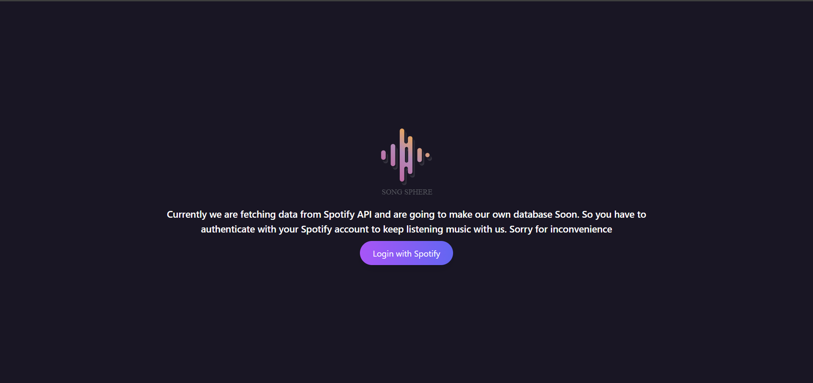
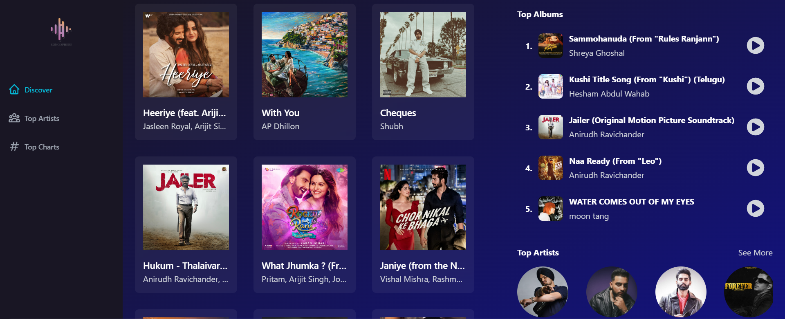
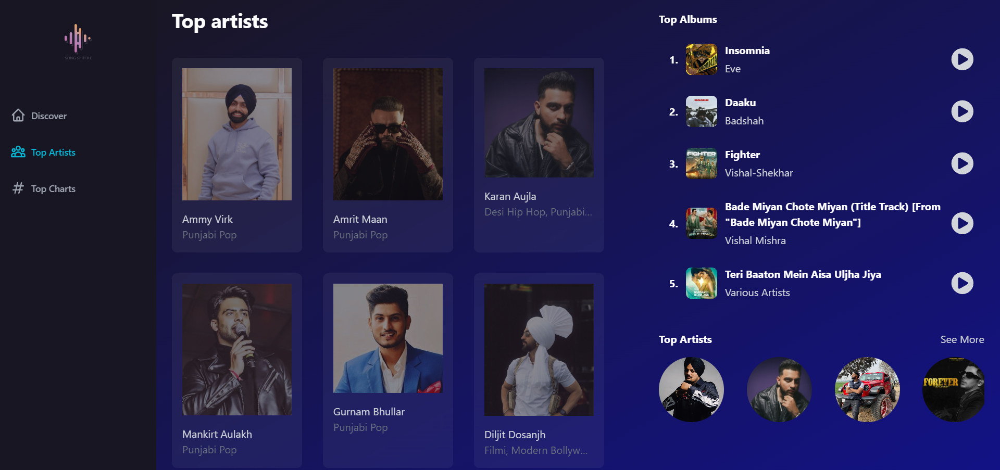
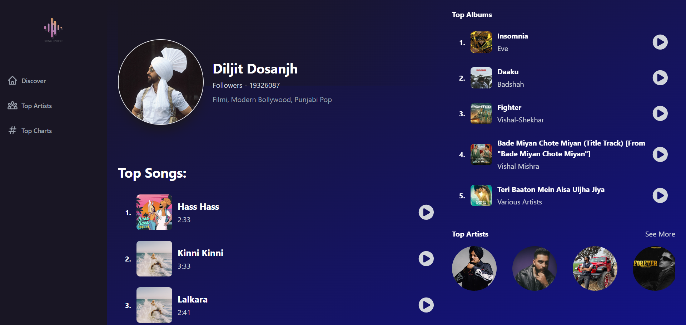

# Spotify Music Player App

This is a music player application built with React that allows users to fetch songs from their Spotify account. The app consists of several pages including Home, Top Artist Page, Individual Artist Page, and a Login Page to authenticate and fetch data from the user's Spotify account.

## Screenshots

### Login Page


### Home Page


### Top Artist Page


### Individual Artist Page



## Features

- **Spotify Integration**: Authenticate with Spotify to fetch user's music library.
- **Home Page**: Display personalized recommendations and recently played songs.
- **Top Artist Page**: Show top artists based on user's listening history.
- **Individual Artist Page**: View details and tracks of a specific artist.
- **Responsive Design**: Optimized for various screen sizes and devices.

## Getting Started

To run this application locally, follow these steps:

1. **Clone the Repository**: git clone https://github.com/bhaveymunjal/Song-Sphere.git
2. **Navigate to the Project Directory**: cd Song-Sphere
3. **Install Dependencies**: npm install
4. **Set Up Spotify API Keys**:
- Visit the [Spotify Developer Dashboard](https://developer.spotify.com/dashboard/) and create a new application.
- Obtain the Client ID and Client Secret.
- Create a `.env` file in the root directory of the project and add your Spotify Client ID and Client Secret:
  ```
  SPOTIFY_CLIENT_ID=your-client-id
  SPOTIFY_CLIENT_SECRET=your-client-secret
  ```
5. **Run the Application**: npm start
6. **Open in Browser**: Open your web browser and navigate to `http://localhost:3000`.

## Technologies Used

- React.js
- Spotify API
- HTML5
- Tailwind CSS
- JavaScript

## Feedback and Support

We value your feedback and are constantly working to improve our music player application. If you encounter any issues, have suggestions for new features, or need support, please don't hesitate to reach out. You can give your suggestions here at bhaveymunjal3@gmail.com.
